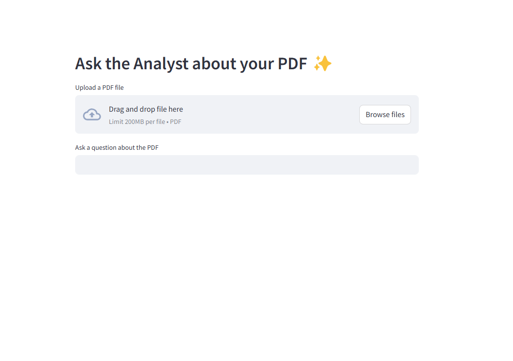

# A Simple Chatbot for your PDF  
## [Show me the code](https://github.com/yavuzkaymak/chatpdf)

## User Interface
We are using streamlit for the UI. Create a .streamlit folder and a secrets.toml file to store your secrets.

## PDF Parsing

We use llama-index's pdf's parser. You can get a free API Key from [LLamaCloud](https://cloud.llamaindex.ai/).
You need to add the API key to the secrets.toml like

```
LLAMA_CLOUD_API_KEY="<your cool key>"
```

## Vector Store
We use Supabase's Postgress as vector db. You can open a free account from [supabase](https://supabase.com/)
You need to store the URL and API Key in secrets.toml

```
SUPABASE_SERVICE_KEY="<your_key>"
SUPABASE_URL="<supabase url>"
```
After openning the account you need to create a table and a function:

```sql
create table
  documents (
    id uuid primary key,
    content text, 
    metadata jsonb, -
    embedding vector (768) 
  );
```

```sql
create function match_documents (
  query_embedding vector(1536),
  match_count int default null,
  filter jsonb DEFAULT '{}'
) returns table (
  id bigint,
  content text,
  metadata jsonb,
  similarity float
)
language plpgsql
as $$
#variable_conflict use_column
begin
  return query
  select
    id,
    content,
    metadata,
    1 - (documents.embedding <=> query_embedding) as similarity
  from documents
  where metadata @> filter
  order by documents.embedding <=> query_embedding
  limit match_count;
end;
$$;
```

For further info refer to [Langchain](https://supabase.com/docs/guides/ai/langchain?queryGroups=database-method&database-method=sql)


## LLM
We are using Ollama to run the models. Currently we are using phi4 but you can choose any model you like.

You can follow through [Ollama](https://ollama.com/)'s  documentation or just using Docker:

```bash
docker run -d --name ollama -v ollama:/root/.ollama -p 11434:11434  ollama/ollama
```

then pull the phi4 model

```
docker exec -it ollama ollama pull phi4
```

for the embedding model:

```
docker exec -it ollama ollama pull nomic-embed-text
```

## How to run?

```
 streamlit run main.py --logger.level debug
```

